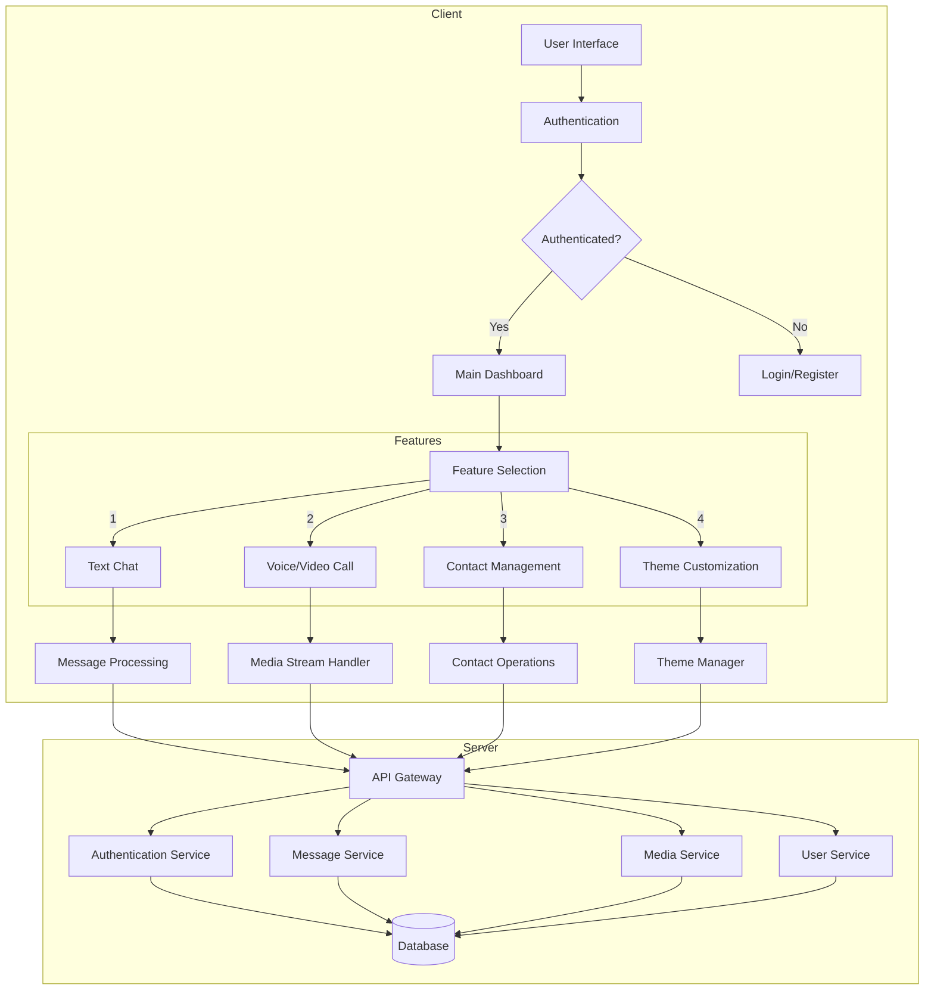

# 🌟 Chatify - Connect, Chat, Create Memories 🌟

Chatify is a feature-rich chat application that enables seamless communication across the globe, offering persistent messaging, voice/video calls, and customizable themes.

## 🔍 System Architecture & Flow



## 🌟 Features

### Core Functionality
- **Persistent Messaging**: All messages are stored permanently
- **Global Connectivity**: Chat with users worldwide without contact prerequisites
- **Multimedia Communication**: Integrated voice and video calling
- **Contact Management**: Built-in contact list organization
- **Privacy Protection**: Secure data handling and storage
- **Theme Customization**: 13 unique themes for personalized experience

## 🛠️ Technical Stack

### Frontend
- React.js for UI components
- WebRTC for real-time communication
- Socket.io for real-time events
- Redux for state management
- Styled-components for theming

### Backend
- Node.js/Express.js server
- MongoDB for data persistence
- Socket.io for WebSocket connections
- JWT for authentication
- Media streaming services

## 🚀 Getting Started

### Prerequisites
- Node.js (v14 or higher)
- MongoDB
- npm or yarn

### Installation

1. Clone the repository
```bash
git clone https://github.com/NeelSheth-Developer/Chatify.git
cd Chatify
```

2. Install dependencies
```bash
# Install server dependencies
cd server
npm install

# Install client dependencies
cd ../client
npm install
```

3. Configure environment variables
```bash
# Create .env file in server directory
cp .env.example .env
```

4. Start the application
```bash
# Run server
cd server
npm start

# Run client
cd client
npm start
```

## 🔒 Security Features

- End-to-end encryption for messages
- Secure authentication system
- Protected API endpoints
- Data privacy compliance
- Regular security audits

## 🎨 Theme Customization

Chatify offers 13 distinct themes that users can switch between:
- Light/Dark modes
- Various color schemes
- Custom accent colors
- Personalized chat backgrounds

## 📱 Responsive Design

The application is fully responsive and works seamlessly across:
- Desktop browsers
- Mobile devices
- Tablets
- Progressive Web App (PWA) support

## 🤝 Contributing

We welcome contributions! Please follow these steps:

1. Fork the repository
2. Create a feature branch (`git checkout -b feature/AmazingFeature`)
3. Commit changes (`git commit -m 'Add AmazingFeature'`)
4. Push to branch (`git push origin feature/AmazingFeature`)
5. Open a Pull Request

## 📄 License

This project is licensed under the MIT License - see the [LICENSE](LICENSE) file for details.

## 🌟 Live Demo

Experience Chatify live at: [https://chatify-evbk.onrender.com/](https://chatify-evbk.onrender.com/)

## 🙏 Acknowledgments

- Thanks to all contributors
- Special thanks to the open-source community
- Inspired by modern chat applications

---
Developed by Neel Sheth
